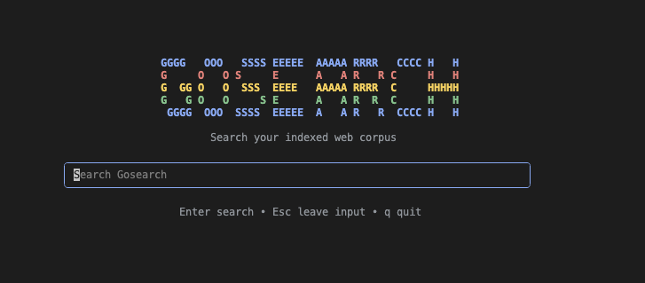
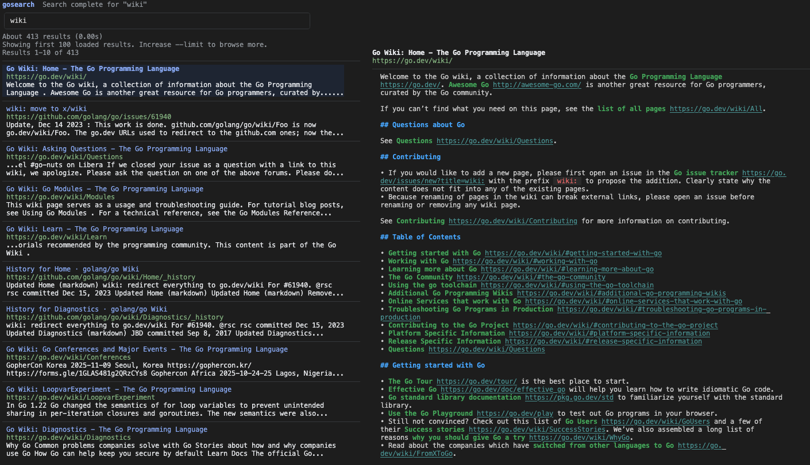

# gosearch

[](https://github.com/abuiliazeed/gosearch/actions/workflows/quality.yml)
[](https://github.com/abuiliazeed/gosearch/releases)
[](https://pkg.go.dev/github.com/abuiliazeed/gosearch)
[](https://opensource.org/licenses/MIT)
[](https://go.dev/)

<p align="center">
  
</p>

> A self-hosted search engine for AI agents

**gosearch** is a fast, concurrent web crawler and search engine designed for AI agent workflows. Features a custom inverted index, fuzzy matching, TF-IDF ranking, JSON API output, and agent-friendly markdown export for seamless integration with LLM applications.

---

## Why gosearch?

| Feature | gosearch | Bleve | Zinc | Meilisearch |
|---------|----------|-------|------|-------------|
| **Zero dependencies** | ✅ Single binary | ❌ Requires indexing lib | ❌ Heavy deps | ❌ Requires server |
| **Markdown-native** | ✅ Built for LLMs | ❌ Generic docs | ❌ JSON only | ❌ JSON only |
| **Self-contained** | ✅ No external DB | ❌ Needs storage backend | ❌ Needs Elasticsearch | ❌ Separate server |
| **CLI-first** | ✅ TUI + commands | ❌ Library only | ⚠️ API-first | ❌ API-only |
| **Learning resource** | ✅ Clean Go code | ⚠️ Complex codebase | ⚠️ Forked from Zinc | ❌ Rust codebase |
| **Footprint** | ~15MB binary | ~50MB+ | ~100MB+ | ~150MB+ |

### When to use gosearch

- **AI/LLM workflows** — Markdown output ready for RAG pipelines
- **Learning search engines** — Clean, readable Go implementation
- **Lightweight deployments** — Single binary, no infrastructure
- **CLI automation** — Scriptable search and crawl operations
- **Offline search** — Self-contained, no internet required

### When to use alternatives

- **Production scale** — Meilisearch for millions of docs
- **Full-text search** — Bleve for existing Go apps
- **Multi-tenant SaaS** — Zinc for API-first applications

---

## Features

- **Web Crawling** — Concurrent crawler with Colly framework and configurable queue limits
- **Inverted Index** — Custom implementation with compression for fast lookups
- **Boolean Search** — Support for AND, OR, NOT operators and phrase queries
- **Fuzzy Matching** — Levenshtein distance for typo-tolerant search
- **Page Ranking** — TF-IDF scoring for relevance-based results
- **Query Caching** — Optional Redis-based result caching
- **CLI Interface** — Full-featured command-line interface with Cobra
- **Interactive TUI** — Google-inspired terminal UI with live markdown preview

---

## Quick Start

### Prerequisites

- **Go 1.24.2** or later
- **Docker** (recommended for Redis) or local Redis installation

### Install

**Download binary (recommended):**

```bash
# macOS/Linux
curl -sSL https://github.com/abuiliazeed/gosearch/releases/latest/download/gosearch_$(uname -s)_$(uname -m).tar.gz | tar xz
sudo mv gosearch /usr/local/bin/

# Or with Go
go install github.com/abuiliazeed/gosearch/cmd/gosearch@latest
```

**Build from source:**

```bash
git clone https://github.com/abuiliazeed/gosearch.git
cd gosearch
go build -o bin/gosearch ./cmd/gosearch
```

### Usage

```bash
# Crawl a website
./bin/gosearch crawl https://example.com --max-queue 20 --depth 2 --workers 10

# Search
./bin/gosearch search "query here"

# Interactive TUI
./bin/gosearch tui
```

---

## Usage Examples

### Crawling

```bash
# Crawl with queue limit to prevent infinite crawling
./bin/gosearch crawl https://en.wikipedia.org/wiki/FIFA \
  --max-queue 20 \
  --depth 2 \
  --workers 10

# Output includes timing metrics:
# Crawling took: 5s
# Indexing took: 200ms
# Saving index took: 45ms
# Total time: 5.3s
```

### Searching

```bash
# Simple search
./bin/gosearch search "golang tutorial"

# Boolean query
./bin/gosearch search "golang AND tutorial"

# Phrase query
./bin/gosearch search "\"golang tutorial\""

# Fuzzy search (typo tolerance)
./bin/gosearch search "golang~1" --fuzzy

# Search without cache
./bin/gosearch search "query" --no-cache
```

### Interactive TUI

```bash
# Start TUI
./bin/gosearch tui

# Start with initial query
./bin/gosearch tui "sourcebeauty"

# Increase result limit
./bin/gosearch tui "sourcebeauty" --limit 200
```

<p align="center">
  
</p>

**TUI Key Bindings:**
- `/` — Focus search input
- `j`/`k` — Navigate results
- `n`/`p` — Next/previous page
- `Enter` — Open full preview
- `o` — Open URL in browser
- `y` — Accept "Did you mean" suggestion
- `q` — Quit

### Agent-Friendly Retrieval

```bash
# Get full stored markdown as JSON
./bin/gosearch search-item "sourcebeauty" --rank 1

# Export domain markdown files
./bin/gosearch md-export sourcebeauty.com --output-dir ./exports
```

### Index Management

```bash
# Build index from crawled pages
./bin/gosearch index build

# Show index statistics
./bin/gosearch index stats

# Clear the index
./bin/gosearch index clear
```

---

## Configuration

gosearch can be configured via:

1. **Command-line flags** (highest priority)
2. **Environment variables** (prefixed with `GOSEARCH_`)
3. **Config file** (`~/.gosearch.yaml` or `.gosearch.yaml`)

### Environment Variables

```bash
export GOSEARCH_DATA_DIR=./data
export GOSEARCH_MAX_WORKERS=10
export GOSEARCH_REDIS_HOST=localhost:6379
```

### Config File Example

```yaml
data-dir: ./data
max-workers: 10
max-depth: 3
log-format: text
log-level: info
redis:
  host: localhost:6379
  password: ""
  cache-ttl: 3600
```

---

## Architecture

```
gosearch/
├── cmd/gosearch/          # Main application entry point
├── internal/              # Private packages
│   ├── crawler/           # Web crawler with Colly
│   ├── indexer/           # Inverted index implementation
│   ├── search/            # Query processor
│   ├── ranker/            # TF-IDF ranking
│   └── storage/           # Data persistence (v2 markdown-only)
└── pkg/                   # Public packages
    ├── cli/               # CLI commands
    └── config/            # Configuration management
```

---

## Development

### Running Tests

```bash
# Run all tests
go test ./...

# Run with race detector
go test -race ./...

# Run benchmarks
go test -bench=. -benchmem ./...
```

### Code Quality

```bash
# Format code
go fmt ./...

# Run vet
go vet ./...

# Run linter (requires golangci-lint)
golangci-lint run

# Run pre-deploy checks
bash scripts/pre-deploy.sh
```

### Makefile Commands

```bash
make build       # Build the binary
make run         # Build and run
make test        # Run tests
make race        # Run tests with race detector
make fmt         # Format code
make vet         # Run go vet
make clean       # Clean build artifacts
```

---

## License

[MIT License](LICENSE) — see LICENSE file for details.
